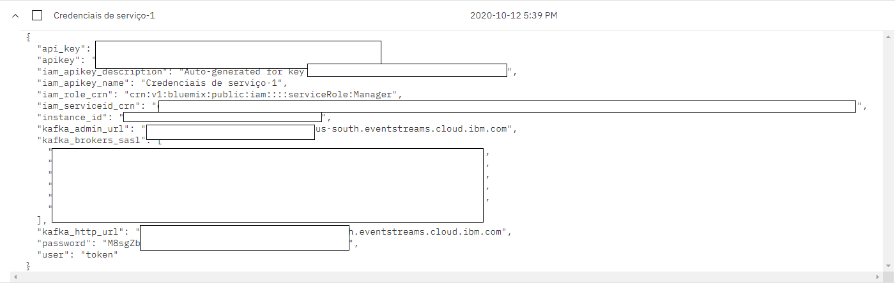

    

    
    
	
	

<b>Ranking das músicas mais ouvidas em tempo real com Event Streams</b>
   
  
   

## Table of contents

- [Introdução](#introdução) :seedling:
- [Requisitos](#requisitos) :beetle:
- [Provisionando o Event Streams](#provisionando-o-event-streams-na-ibm-cloud-e-obtendo-as-credenciais-de-serviço) :hammer:
- [Utilizando a API do Twitter](#features) :gift:

- [Creators](#creators) :space_invader:
- [Contributors](#contributors) :raised_hands:

## Introdução
O IBM Event Streams for IBM Cloud é uma plataforma de streaming de dados escalável, distribuida e com alto throughput para unificar suas tecnologias on-premise ou off-premise. Com o Event Streams, você pode conectar microsserviços usando protocolos abertos, conectar dados em stream com ferramentas de analytics para obter insights poderosos e alimentar dados de eventos em vários aplicativos em tempo real. 

Esta aplicação é uma demonstração do uso do Event Streams, e tem como objetivo listar e quantificar as músicas que estão sendo ouvidas em tempo real. Para isso, vamos utilizar o tweepy para monitorar a hashtag <b>#nowPlaying</b> no twitter, onde os usuários costumam compartilhar as músicas que estão ouvindo no momento. Além disso, vamos utilizar o <b>Event Streams</b> para processar os dados que estão sendo recebidos em tempo real.  

A aplicação conta com a seguinte arquitetura: Um Producer, que recebe os dados através da API do twitter em tempo real e envia para o Event Streams, e um Consumer, recebe estes dados, filtra os mesmos para obter apenas o nome das músicas e dos autores e conta quantas vezes cada música está sendo ouvida. 
    
Para obter apenas o nome da música e do autor, buscaremos pela url "open.spotify.com/track" nos tweets recebidos. Caso o tweet contenha esta URL, utilizaremos o BeautifulSoup para acessar a URL e obter o nome da música e do artista. Desta forma, conseguimos garantir que estas informações estarão corretas e sem a existência de "sujeira" nos dados.

## Requisitos
- Python 3.6 ou mais recente (https://www.python.org/downloads/)
- Conta na IBM Cloud (https://cloud.ibm.com/registration)
- VSCode ou editor de sua preferência
- tweepy (<b>pip install tweepy</b>)
- kafka-python (<b>pip install kafka-python</b>)
- beautifulsoup4 (<b>pip install beautifulsoup4</b>)
- Event Streams Lite na IBM Cloud ([Provisionando o Event Streams](#provisionando-o-event-streams-na-ibm-cloud-e-obtendo-as-credenciais-de-serviço))

## Provisionando o Event Streams na IBM Cloud e obtendo as credenciais de serviço
1 - No Painel da IBM Cloud, clique em 'Catalogo' 
2 - No menu lateral do Catálogo, selecione a opção "Serviços"  
3 - Role a página até encontrar o Event Streams.  
  
4 - Ao selecionar o serviço, você será direcionado para a página de provisionamento do mesmo. Selecione a região em que o serviço será criado, escolha o plano "Lite", que é o plano gratuito do serviço (OBS: Você só pode ter um Event Streams Lite por conta. Caso já tenha um provisionado, não será possível criar novamente). Escolha um nome para o serviço e um resource Group, e clique em "Criar" no canto inferior direito.   
5 - Feito Isso, você será direcionado para a página inicial do produto. Nesta página você poderá encontrar a opção "Introdução" no menu lateral, que contém um tutorial sobre o uso do Event Streams. Na opção "Gerenciar", será possível encontrar o dashboard do Event Streams.   
  
6 - Para nossa aplicação, vamos precisar de apenas um tópico. Para criar este tópico, selecione a opção "Criar um tópico", no dashboard do Event Streams. <b>Coloque o nome "nowPlaying para o seu tópico"</b>, selecione apenas 1 partição e mantenha o período de retenção em  "Um dia". Depois de selecionar estas opções, basta clicar em "Criar Tópico".  
7 - <b>Gere as credenciais do Event Streams.</b> Para que você possa se conectar com o produto, gere suas credenciais. para isso, selecione "Credenciais de Serviço" no menu lateral, clique em "Nova Credencial", dê um nome para sua credencial e selecione a função "Gerente". Depois, clique em "Incluir"  
  
8 - Ao expandir a credencial gerada, você verá um JSON com todas as informações necessárias para realizar a conexão.

## Obtendo as credenciais do Twitter
Para poder executar esta aplicação, você precisa gerar suas credenciais do twitter. Para isso, siga este passo a passo:   
1 - <a href="https://developer.twitter.com/en/apply-for-access">Se aplique para uma conta de desenvolvedor no Twitter</a>   
2 - Entre em https://developers.twitter.com/en/apps e clique em "Create an app" e preencha os campos pedidos.   
3 - Após a criação da aplicação, clique em "Keys and Tokens", e na sessão "Access token & access token secret" clique em "Generate". Então, copie as credenciais que foram geradas.

## Executando a aplicação
Após o provisionamento do Event Streams, com a criação do tópico e das credenciais, e a geração das credenciais do twitter, a aplicação poderá ser executada. 
1 - Clone este repositório: git clone https://github.com/lucas2179/EventStreams-TnL.git    
<b>2 - No arquivo config.py, copie o json com as credenciais geradas pelo Event Streams e cole  na variável "eventstream  
3 - No mesmo arquivo, substitua o valor das seguintes variáveis: "access_token access_token_secret, consumer_key, consumer_secret" pelas credenciais geradas no twitter.</b>  
4 - O arquivo producer.py é o código responsável por receber  os tweets e enviar para o Event Streams. Este arquivo possui três classes: Uma para a autenticação do tweepy, outra que busca os tweets em tempo real, e por último, a classe responsável por enviar as mensagens para o kafka através do comando "producer.send". Para executar este arquivo, abra o CMD e digite "<b>python producer.py</b>"  
5 - O arquivo consumer.py contém o codigo responsável por receber as mensagens do Event Streams, verificando se existe a URL do Spotify nos tweets. Caso esta url esteja presente, utilizamos o BeautifulSoup para acessar a página e obter o nome da música e do artista. Então, o código irá retornar quantas vezes cada música está sendo ouvida em tempo real. Para executar este arquivo, abra o CMD e digite "<b>python consumer.py</b>"

## Creator
**Lucas Souza** (lucas.souza@ibm.com)
- <https://www.linkedin.com/in/lucas-souza-38196b156>

